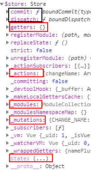
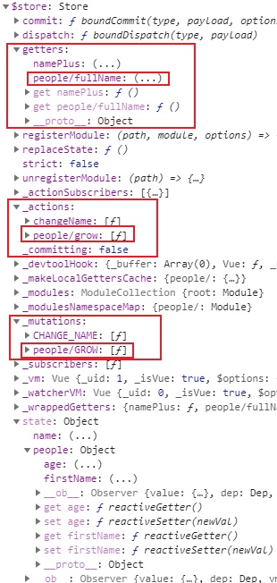

# 模块

## 默认情况


index.js

```js
import Vue from 'vue'
import Vuex from 'vuex'
import people from './People'

Vue.use(Vuex)

export default new Vuex.Store({
  state: {
    name: 'Jack'
  },
  getters: {
    namePlus: state => state.name + '01'
  },
  mutations: {
    CHANGE_NAME (state, obj) {
      state.name = state.name + obj.str
    }
  },
  actions: {
    changeName ({ state, commit }) {
      setTimeout(() => {
        commit('CHANGE_NAME', { str: 'kk' })
      }, 1000)
    }
  },
  modules: {
    people
  }
})
```

people.js

```js
export default {
  state: {
    firstName: 'z',
    age: 20
  },
  getters: {
    fullName (state) {
      return state.firstName + 'z'
    }
  },
  mutations: {
    GROW (state) {
      state.age += 1
    }
  },
  actions: {
    grow ({ commit }) {
      setTimeout(() => {
        commit('GROW')
      }, 1000)
    }
  }
}
```

在主入口文件 main.js 中打印根实例：

```js
// ...
new Vue({
  router,
  store,
  render: h => h(App),
  mounted () {
    console.log(this)
  }
}).$mount('#app')
```


进入状态实例 $store：



可以发现平时在组件中使用的 commit、dispatch 方法其实是状态实例下面的属性。

进一步展开：


默认情况下，模块 people.js 中的getter、mutation、action是组测在全局命名空间的，而 state 是在局部命名空间下的。

## 使用 `namespaced: true`

people.js

```js
export default {
  namespaced: true,
  state: {
    firstName: 'z',
    age: 20
  },
  getters: {
    fullName (state) {
      return state.firstName + 'z'
    }
  },
  mutations: {
    GROW (state) {
      state.age += 1
    }
  },
  actions: {
    grow ({ commit }) {
      setTimeout(() => {
        commit('GROW')
      }, 1000)
    }
  }
}
```



添加 `namespaced: true`，getter、action 及 mutation 都会自动根据模块注册的路径调整命名。注意这里是直接修改相应的名称，如 fullName -> people/fullName，而不是像 state 一样，将其置于 people 对象中作为键。

### 使用

在组件中通过如下方式使用状态：

```js
this.$store.state.people.firstName
```

```js
computed: {
  ...mapState('people', ['firstName']), // 使用：this.firstName
}
```

使用 action:

```js
this.$store.dispatch('people/grow')
```

```js
methods: {
  ...mapActions(['people/grow']) // 调用：this['people/grow']()
}
```

```js
methods: {
  ...mapActions('people', ['grow']) // 调用：this.grow()
}
```


