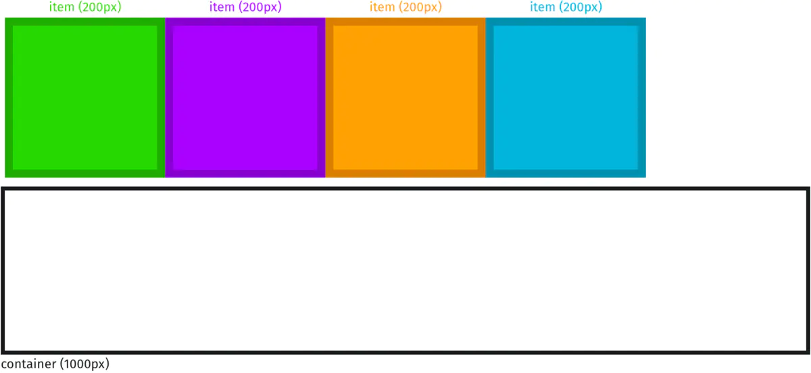
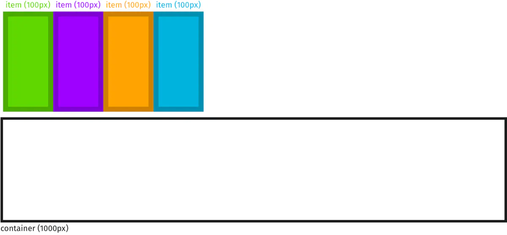

# Flex Basis与Width的区别

[Flex Basis与Width的区别](https://www.jianshu.com/p/17b1b445ecd4)

Flex 项目默认在容器中不换行水平排列，项目的 flex-basis 表示项目在被放进一个 flex 容器之前的宽度，即项目不伸缩时的初始宽度。

当所有项目的初始宽度之和小于容器宽度时，如果项目 flex-grow 不为0，项目就会伸长。项目最终的宽度 = 初始宽度 + 伸长的宽度。

当所有项目的初始宽度之和小于容器宽度时，如果项目 flex-shrink 不为0，项目就会收缩。项目最终的宽度 = 初始宽度 - 收缩的宽度。

所以知道项目的初始宽度很重要，因为项目的最终宽度跟其有关。

如何确定项目的初始宽度（即flex-basis）呢？

- 显式的设置了项目的 flex-basis 属性，属性值可以为带单位的长度值，或者百分数，如100px、50%。

- 如果没有显示设置项目的 flex-basis 属性，但设置了项目的 width 属性，那么初始宽度就是 width 属性的大小。

- 如果 flex-basis、width 都没设置，初始宽度就是项目内容（content）的宽度。

- 如果同时设置 flex-basis、width，初始宽度取 flex-basis 值。

即下面从左至右，优先级逐渐增大：

content –> width –> flex-basis (limted by max|min-width)

下面通过给一个1000px的flex容器来添加一些flex items来说明一下Flex Items的应用准则：

```css
.container {
    display: flex;
    width: 1000px;
}
```


## 设置宽度(Width)

添加四个200x200像素的items到flex容器中

```css
.item {
    width: 200px;
    height: 200px;
}
```



因为flex容器有足够多的空间，所以items可以很好的填充在容器内部，最终：


上面的示例就是当flex-basis没有被指定，默认值是flex-basis: auto，也就意味着items以宽度width(200px)为准。

## 设置一个Flex Basis值

让我们看看当给这些已经设置固定宽度width的items设置一个flex-basis值会发生什么。

```css
.item {
    width: 30px;
    flex-basis: 250px;
}
```


就像你所看到的，当指定一个flex-basis值的时候，盒子的宽度属性被忽略了，所以我们就不需要指定盒子的宽度width属性了

```css
.item {
    flex-basis: 250px;
}
```

items完全填充了flex容器：


因此items的宽度关键在于最终的flex-basis。最佳的方法是只使用flex-basis而不是width或height属性。特别是Safari 10之前的版本的浏览器有一个flexbox bug，在给items应用flex-shrink属性的时候，浏览器会使用height属性而不是flex-basis。

## 使用max-width来限制flex-basis

min-width和max-width会限制flex-basis值。下面是给flex items设置max-width的结果：

```css
.item {
    flex-basis: 250px;
    max-width: 100px;
}
```


可以看到即使我们将flex-basis设置为250px，item的宽度还是被限制在了100px。所以在这个示例中最终的flex-basis是100px：


接着试试min-width来看看最终的flex-basis有什么不同：

```css
.item {
    flex-basis: 100px;
    min-width: 250px;
}
```


可以看到最终item的宽度是250px而不是100px：


## Flex-basis到底是什么？

现在我们知道了width属性只是一个当flex-basis没有被设置时的回退选项。min-width和max-width则是flex-basis的下限和上限。那么flex-basis到底是什么呢？

也许你注意到了上面我们所有的示例在将flex items放入flex容器之前都直观地列出了flex items的大小。之所以这么做是因为这就是flex-basis的含义：flex items 在被放进一个flex容器之前的大小。也就是items理想或假设的大小。但是flex-basis不能保证其大小！一旦将items放入flex容器中，flex-basis的值就无法保证了。在上面的示例中，你可以看到flex items完美地填充了容器，那是因为容器的大小正好等于items最终的flex-basis之和。但是如果容器没有足够的空间来容纳或者有多余的空间呢？下面就分别讲解一下这两种情况。

## 当没有足够空间的时候

比方说我们想要放更多的flex-basis：200px的items到我们的容器：


在items被放进容器之前，每个item会占据200px，所有的items会占据1600px。但是容器只有1000px。当容器没有足够大的空间来存放所有的items的时候，flex items会按照压缩率(shrink rate)被压缩(shrink)其大小来填充容器,这个压缩率就是flex-shrink来设置的，默认情况下每个item的压缩率都是一样的：


## 当有额外的空间的时候

通常我们会有额外的空间剩余当所有的items都添加进容器后：

```css
.item {
    flex-basis: 100px;
}
```



我们可以控制flex items的增长来填充可用的空间，这也就是flex-grow属性的作用。默认值为0，意味着item不会增长。如果将每个item设置flex-grow： 1，那么所有 的item都会等比例的增长来填充剩余的空间：

```css
.item {
    flex-basis: 100px;
    flex-grow: 1;
}
```


以上这些设置同样适用于height属性，当你将flex-direction设置为column或者column-reverse的时候。