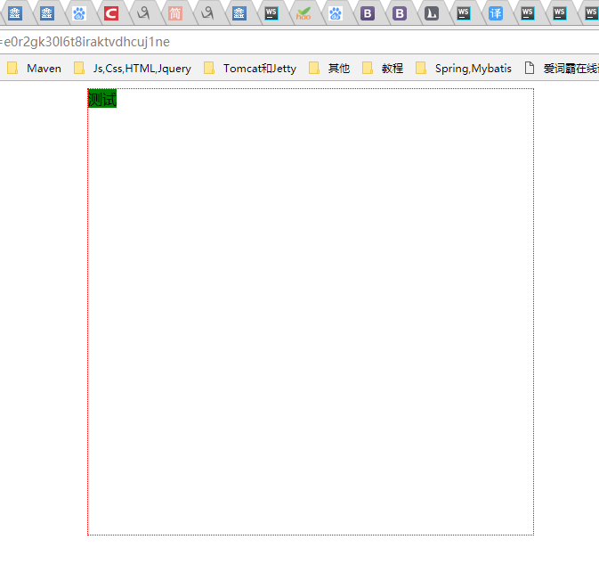

# 绝对定位

目录

- [最初包含块是 html](#最初包含块是html)
- [display 类似 inline-block](#display类似inline-block)
- [父元素绝对定位，有类似清除浮动的作用](#父元素绝对定位有类似清除浮动的作用)
- [子元素绝对定位，父元素会塌陷](子元素绝对定位父元素会塌陷)
- [父子元素的边界问题](父子元素的边界问题)

## 最初包含块是 html

如果祖先元素找不到 position 为 relative，absolute，fixed，则相对最初的包含块定位。最初的包含块指的是 html。当仅设置`position: absolute;`而没有设置`top`、`right`、`bottom`、`left`时，此时元素跟设置`position: absolute;`之前的位置一样，只是元素已不再文档流中，不占据文档流空间。

```html
···
<style>
  html {
    background-color: #ccc;
  }
  body {
    width: 500px;
    margin: 0 auto;
    padding: 50px;
    background-color: lightblue;
  }
  div {
    position: absolute;
    top: 0;
    left: 0;
    width: 300px;
    background-color: yellow;
  }
</style>
<body>
  <div>测试绝对定位最初包含块</div>
</body>
```


## display 类似 inline-block

元素定位后生成一个块级框，而不论原来它在正常流中生成何种类型的框。绝对定位后元素的 width 不能再 100%父元素，此时更像是“inline-block”,长度由内容撑开。

```html
<sytle>
  .d1 {
    width: 500px;
    height: 500px;
    margin: 0 auto;
    border: 1px solid red;
  }
  .d2 {
    position: absolute;
    background-color: green;
  }
</style>
<body>
  <div class="d1">
    <div class="d2">测试绝对定位元素宽度width是否扩展至父元素!</div>
  </div>
</body>
```



## 父元素绝对定位，有类似清除浮动的作用

## 子元素绝对定位，父元素会塌陷

## 父子元素的边界问题
